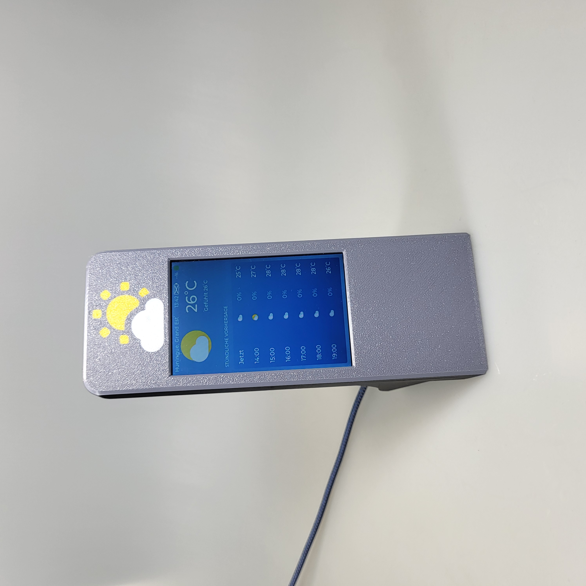
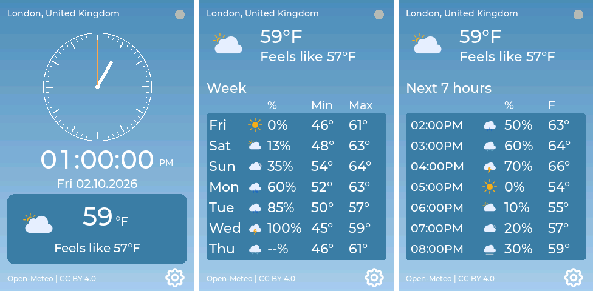

# ESP32 weather forecast screen

A desktop weather display built around a 4-inch ESP32 touchscreen. It shows the local time, current weather and daily and hourly forecasts from Open-Meteo. The project includes Rust firmware for the Freenove FNK0103S display with an ESP32-WROOM-32E module, plus a 3D-printable enclosure and stand. An optional HLK-LD2410C radar detects presence to wake the screen.

The firmware was created using AI and agentic coding tools under human supervision.

<p align="center">

</p>

The photograph shows the assembled display running an older version of the firmware. The screenshots below show the current interface with example data.

## The interface

The 320 × 480 portrait display has a blue gradient background, white Montserrat text and darker blue weather panels. The Clock page combines an analogue dial with digital time and a local date. A rounded card below shows the weather symbol, current temperature and feels-like temperature.

The Week page shows today and the next six days, with weather symbols, precipitation probabilities and minimum and maximum temperatures. The Hours page shows the next seven hourly forecasts, with temperatures and precipitation probabilities. Both fit seven rows on the screen without scrolling. A settings gear and weather source credit sit at the bottom of each page.

<p align="center">

</p>

## Printing, assembly and use

The [printing and assembly guide](printable_3D_model/README.md) includes the model files, parts list, print settings and radar wiring. The [illustrated user guide](USER_GUIDE.md) covers firmware installation, first startup, Wi-Fi, touchscreen controls, location search and settings.

## Building on Linux

Install [Rust with rustup](https://rustup.rs/) and the Linux host dependencies listed in the [esp-rs prerequisites](https://github.com/esp-rs/esp-idf-template#generate-the-project), including CMake, Ninja, Python and libclang. Then install the ESP32 toolchain and linker proxy:

```sh
cargo install espup --locked
espup install
cargo install ldproxy --locked
```

In each build shell, load the environment created by espup. Its default path is:

```sh
. "$HOME/export-esp.sh"
```

From the repository root, build the release firmware:

```sh
./build.sh
```

The project selects the `esp` Rust toolchain, the `xtensa-esp32-espidf` target and ESP-IDF `v5.5.5`. The first build needs internet access to download the SDK and tools. Use a shell without an `IDF_PATH` override so the pinned SDK is used.

The release ELF is written to `firmware/target/xtensa-esp32-espidf/release/weather-forecast-firmware`. The script forwards extra Cargo arguments, such as `./build.sh --locked` once `firmware/Cargo.lock` exists. It only builds the software.

See the [firmware README](firmware/README.md) for implementation details, host tests, asset generation and documentation previews. Installation steps are in the [user guide](USER_GUIDE.md#installing-the-firmware-under-linux).

To inspect or remove build output and temporary files:

```sh
./clean.sh --dry-run
./clean.sh
./clean.sh --all --dry-run
./clean.sh --all
```

Default cleanup removes Cargo build output, mutation-test output, Python bytecode caches, Rust backup files, `.pdb` files, and generated or old `sdkconfig` files. Tracked files, secrets, backups, and symlinks are preserved. `--all` also removes local `.embuild` SDK caches and the documented `/tmp/weather-wifi-preview` and `/tmp/weather-assets-venv` directories; the next build may download the SDK and tools again. Custom preview destinations and other files under `/tmp` are retained. The script works from any working directory and requires Bash and Git, without requiring Cargo. Run it when builds and preview generators are stopped.

## Building on Windows

**TODO:** To be written in near future!

## Licences and credits

The firmware source code is licensed under [MIT](LICENSE). Third-party components retain their own licences. This project was inspired by [Aura](https://github.com/Surrey-Homeware/Aura).

As of the MIT relicensing change on 4 October 2026, the project's own code is available under MIT. Earlier versions were published under GPL-3.0-only; rights already granted under that licence remain in effect. Third-party code and assets retain their respective licences.

- **Fonts:** [Montserrat](https://github.com/JulietaUla/Montserrat) by Julieta Ulanovsky and contributors (OFL-1.1), using [LVGL](https://github.com/lvgl/lvgl) font source material (MIT).
- **Symbols:** [Meteocons](https://github.com/basmilius/meteocons) by Bas Milius and [Tabler Icons](https://github.com/tabler/tabler-icons) by Paweł Kuna (MIT).
- **Display:** ST7796 initialization adapted from [TFT_eSPI](https://github.com/Bodmer/TFT_eSPI/tree/V2.5.43) by Bodmer (MIT/BSD).
- **Platform:** [ESP-IDF](https://github.com/espressif/esp-idf/tree/v5.5.5) and Rust libraries listed in the [dated dependency CSV](docs/third-party-rust-2026-10-04.csv). ESP32 Wi-Fi and PHY require precompiled Espressif libraries without publicly available complete implementation source.
- **HTTPS certificates:** [Mozilla CA certificate data](https://curl.se/docs/caextract.html) (MPL-2.0).
- **Weather and locations:** [Open-Meteo](https://open-meteo.com/) and [GeoNames](https://www.geonames.org/) (data attribution under CC BY 4.0). Open-Meteo's free API has [non-commercial service terms](https://open-meteo.com/en/terms).

See the [third-party declaration dated 4 October 2026](docs/third-party-declaration-2026-10-04.md) for sources, versions, licences and attribution details.

Binary firmware distributions must include the accompanying third-party notices and required source materials. See the [release licensing workflow](docs/FIRMWARE_RELEASE_LICENSES.md) for the collected notices, offline checks, local packaging and automatic GitHub releases on version tags.

## TODO

- [ ] Reuse the display’s BOOT button to trigger screen recalibration.
- [ ] Add a complete factory reset capability using the display’s RST button.

# Disclaimer

<b>This project and all associated files, documentation, and source code are provided “as is” without any express or implied warranties, including but not limited to the implied warranties of merchantability, fitness for a particular purpose, and non‑infringement. The author and contributors of this repository assume no responsibility or liability for any direct, indirect, incidental, or consequential damages that may occur through the use, modification, or distribution of the software and hardware designs contained herein. This includes, but is not limited to, hardware damage, data loss, malfunctioning devices, or personal injury that may arise from incorrect wiring, improper configuration, or misuse of the provided code and documentation. Users are encouraged to review, test, and verify all code before deploying it on any system. If you choose to use this project, you do so entirely at your own risk. By downloading, copying, modifying, or using any part of this project, you acknowledge that you have read, understood, and agree to this disclaimer.

The HLK-LD2410C radar module’s CE status is unknown to this project. The existence of an EU declaration of conformity or US regulatory compliance documentation has not been verified. Check your local laws and regulatory requirements before using the radar. Use it at your own risk.</b>
