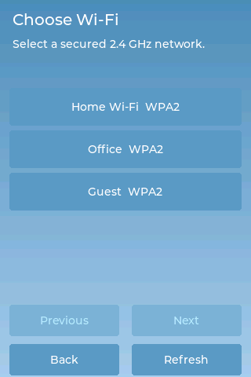
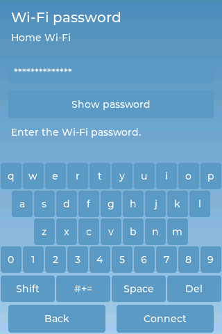
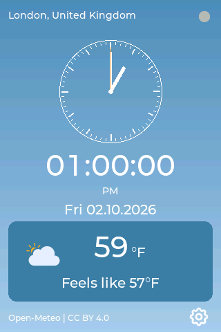
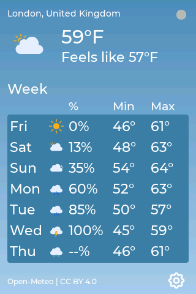
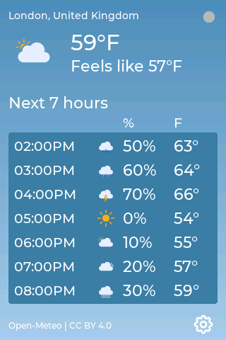
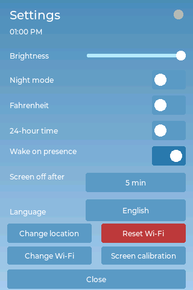
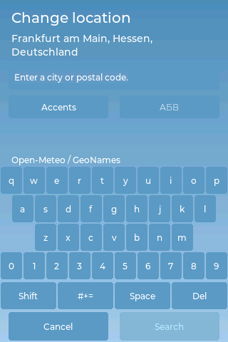
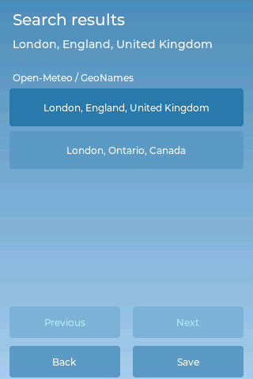
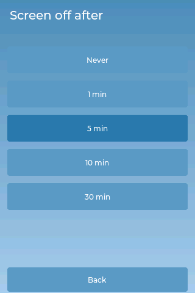

# User guide

The screenshots below come from the firmware renderer at the display's native 320 × 480 resolution and use synthetic weather, network, and location data. They show the controls you will use on the device.

## Installing the firmware under Linux

Build the release firmware using the [Linux build instructions](README.md#building-on-linux). Run the commands below from the repository root. They target the supported classic ESP32 board with 4 MiB flash. Images built for an ESP32-S3 or a different display board are not suitable.

Activate the ESP-IDF Python environment created by the build. It is under `firmware/.embuild/espressif/python_env/`, with a directory name that depends on your Python version. For example, with Python 3.10:

```sh
. firmware/.embuild/espressif/python_env/idf5.5_py3.10_env/bin/activate
```

Convert the release ELF into an application image:

```sh
python -m esptool --chip esp32 elf2image \
  --flash_mode dio --flash_freq 40m --flash_size 4MB \
  --output firmware/target/xtensa-esp32-espidf/release/weather-forecast-firmware.bin \
  firmware/target/xtensa-esp32-espidf/release/weather-forecast-firmware
```

The release directory should now contain `bootloader.bin`, `partition-table.bin` and `weather-forecast-firmware.bin`. Connect the board by USB and check that your terminal user has read and write access to its serial port. Flash the images, replacing `/dev/ttyUSB0` with your board's port if necessary:

```sh
./flash.sh /dev/ttyUSB0
```

The script checks the chip, writes and verifies the images, then restarts the device. It preserves the settings and filesystem partitions. It does not erase the whole flash or program eFuses. The first start opens calibration if no valid calibration is saved.

## First start and Wi-Fi

On the first start, use the stylus to tap the four corner calibration targets, then the centre target. Lift the stylus between taps. The device saves a valid calibration for later starts. If verification fails, repeat the taps. A storage error is shown if the device cannot save the calibration.

The default settings are London, English, Celsius, 12-hour time, full brightness, night mode off, presence wake on and a five-minute screen-off timeout.

Tap **Set up new Wi-Fi**, choose your secured 2.4 GHz network, then enter its password and tap **Connect**. **Refresh** scans again. **Previous** and **Next** move through the network list. Use **Shift** for uppercase, **#+=** for symbols, and **Show password** to check your entry. The password keyboard uses ASCII in every language. A successful connection saves the network. After a restart, the device tries to reconnect automatically.

The device supports WPA2-Personal, WPA3-Personal and mixed WPA2/WPA3 networks. Passwords must contain 8–63 printable ASCII characters, including spaces. Hidden networks, open or WEP networks, enterprise authentication and raw hexadecimal pre-shared keys are not supported.

On startup, a saved network gets a 20-second connection attempt. If that fails, the screen shows the failure and retries every 30 seconds. A connected status means the device has joined Wi-Fi and obtained an IP address. It does not confirm internet access.

The new network replaces the saved one only after connection and saving succeed. Cancelling, scanning or a failed connection keeps the previous network. Storage errors are reported without automatically erasing saved data. **Credentials are stored unencrypted in the device's flash, so someone who can read the flash can recover the password!**

<p align="center">


</p>

## Clock, Week, and Hours

The display opens on **Clock** after connecting. Tap the main content to cycle **Clock → Week → Hours → Clock**. The pages do not rotate automatically.

| Page | What it shows |
| --- | --- |
| Clock | Analogue and digital local time, local date, current temperature, weather symbol, and feels-like temperature. |
| Week | Today and the next six days, with minimum/maximum temperatures and mean daily precipitation probability. |
| Hours | The next seven full hours, with local forecast time, temperature, and precipitation probability. |

<p align="center">



</p>

The location appears above the weather. The footer contains the weather source credit and a settings gear. Missing values appear as dashes. Status messages explain when weather is loading, unavailable or outdated. The Week percentage is the mean daily precipitation probability, rounded to a whole percentage. Hours shows the next seven full forecast hours after the current time.

All pages use the saved location's timezone, including daylight-saving changes. The clock waits for synchronised time and a known timezone. Before then, the analogue dial has no hands. Weather pages show the city and country, while Settings and search retain the full location name.

Forecasts refresh every ten minutes. A failed request is retried after one minute. A failed refresh keeps the previous forecast for the same location and marks it outdated. Data also becomes outdated after twenty minutes without a successful refresh. Missing future entries show dashes, and unknown weather codes use an unavailable symbol. Changing location clears the old forecast. Forecasts are not retained after a restart.

If Wi-Fi drops, the connection screen returns. Once reconnected, the device returns to the selected weather page. Closing Settings or waking the screen also keeps the selected page. A restart opens Clock.

## Settings and language

Tap the footer's gear to open **Settings**, or use **Settings** on the Wi-Fi failure screen. Tap a switch to turn its option on or off, or tap a button to open its choices. The controls work as follows:

<p align="center">


</p>

| Option | What it does |
| --- | --- |
| **Brightness** | Changes the screen's backlight brightness. Drag the slider left to dim it or right to brighten it. The screen previews the change while you drag and saves it when you release. Waking the screen restores this brightness. |
| **Night mode** | Enables nighttime screen blanking from 22:00 to 06:00 in your selected location's timezone. With a finite screen-off timeout, the same inactivity interval applies day and night. With **Never**, night mode can still turn the backlight off at night. Touch or enabled radar presence wakes it and overrides that night's schedule. It does not automatically light up at 06:00. This option does not change the brightness slider. |
| **Fahrenheit** | When on, displays temperatures in °F on all weather pages, including feels-like and minimum/maximum values. When off, uses °C. |
| **24-hour time** | When on, uses times such as **13:00**. When off, uses **01:00 PM**. Applies to the clock, hourly forecast, and time shown in Settings. Your location determines the timezone. |
| **Wake on presence** | Lets a connected radar keep the screen awake or wake it when someone is detected. When off, radar presence does not wake the screen or restart the inactivity timer. Touch still wakes it. |
| **Screen off after** | Chooses how long the screen stays lit without touch or enabled radar presence: **1**, **5**, **10**, or **30 minutes**. **Never** disables inactivity blanking, though night mode may still blank it. Only the backlight turns off. The clock and weather continue updating. See [Screen sleep and wake](#screen-sleep-and-wake). |
| **Language** | Tap the displayed language name to open the language picker, then tap a language to apply and save it immediately. Changes UI labels and messages and the default location-entry alphabet. It does not change your temperature units, time format, or saved location. The eight languages are English, Spanish, German, French, Ukrainian, Swedish, Italian, and Russian. |
| **Change location** | Opens city or postal-code search. Select a result and tap **Save** to update the forecast location and local timezone. See [Choose your location](#choose-your-location). |
| **Reset Wi-Fi** | Asks for confirmation before forgetting the saved network. Use this when you want the device to stop reconnecting to that network. Your preferences, location, and touchscreen calibration are kept. |
| **Change Wi-Fi** | Opens network selection so you can connect to a different network. The new credentials replace the saved network only after a successful connection and save. Cancelling or a failed attempt keeps the previous network. |
| **Screen calibration** | Opens instructions and a **Start** button to recalibrate touch if taps do not line up with controls. Tap four corner targets, then the centre, lifting the stylus between taps. BOOT cancels. A successful verification saves the new calibration. Cancelling or a failed attempt keeps the old one. |
| **Close** | Returns to the weather page you were viewing. It does not discard preference changes that have already been saved. |

Switches, language selection, and the screen-off timeout save as soon as you change them. There is no separate Save button for these preferences. Location changes require **Save**, and brightness saves when you release the slider. If saving a preference fails, the device restores its previous saved value and shows an error. An unreadable saved profile also shows an error and prevents preference changes from being saved. Existing legacy preferences can be imported without erasing them. An unsupported saved language selection falls back to English.

## Recalibrating touch

Use **Screen calibration** in Settings if taps no longer line up with controls. Read the instructions and tap **Start**, or **Back** to return. Tap the four corner targets and the centre verification target, lifting the stylus between taps. BOOT cancels calibration. Each target has a 60-second timeout, and invalid alignment offers a retry. The old calibration is kept until the new one passes verification and is saved.

You can also start recalibration by holding **BOOT for one second while the startup message is visible**. There is a three-second window after boot. Press it after startup begins. Holding BOOT while powering on or resetting selects the ESP32 download mode instead.

## Choose your location

In Settings, tap **Change location**. Enter a city or postal code, tap **Search**, choose the intended result, then tap **Save**. Check the region and country to distinguish places with the same name. Saving updates the weather location and its timezone. Search needs Wi-Fi and synchronised time.

<p align="center">


</p>

**Shift** changes letter case, **#+=** opens symbols, **Accents** opens accented letters, **Space** inserts a space, and **Del** deletes the last character. The **АБВ/ABC** button switches between Cyrillic and Latin without clearing your text. Ukrainian starts with its own Cyrillic alphabet, including **Ґ, Є, І, Ї** and an apostrophe. Russian starts with its alphabet, including **Ё/ё**. Other languages start with Latin input. The saved location is shown above the input field.

Search returns up to 15 results in the selected language. If it times out after ten seconds, check the connection and try again. Leaving the search screen cancels the pending search.

Search terms and location coordinates are sent to Open-Meteo. See its [terms and privacy information](https://open-meteo.com/en/terms) for provider logging details. The free public API is intended for non-commercial use. Commercial deployments need a suitable API plan and endpoint configuration.

## Screen sleep and wake

Tap **Screen off after** in Settings to choose **Never**, **1**, **5**, **10**, or **30 minutes**. The default is five minutes. When the inactivity timeout expires, the backlight turns off while the device keeps updating the clock and weather.

<p align="center">

</p>

Touch wakes the screen. The first waking touch does not activate a control. Radar presence also wakes it when **Wake on presence** is enabled and a radar is connected. The current page is preserved on wake. **Night mode** uses 22:00–06:00 in the selected location's timezone. With a finite timeout, it uses the same inactivity interval. With **Never**, it can still blank the screen at night. Touch or enabled presence overrides that night's schedule. The screen stays dark after morning until you wake it. Night mode waits for synchronised time and a known location timezone before applying its schedule.

Touch and enabled radar presence restart the inactivity countdown. Changing the timeout also restarts it. Calibration keeps the screen awake with at least half brightness. Clock updates, forecast requests and Wi-Fi traffic do not keep it awake. Only the backlight turns off, so this uses more power than deep sleep.

If turning off the backlight fails, the screen remains lit and retries after one minute. If restoring it fails, another touch or presence detection can retry.

## Presence indicator

A small dot at the top right of Settings and Wi-Fi status pages shows radar status:

- Green means presence is detected through serial reports or the radar's OUT pin.
- Red means serial reports are arriving and no presence is detected.
- Grey means no current serial reports are arriving and OUT is inactive.

The indicator keeps updating even when **Wake on presence** is off. A grey dot can mean the radar is disconnected, has no power, is wired incorrectly or uses a different baud rate. A green dot can appear from OUT even without serial reports. The firmware expects the radar's factory settings and does not change them. See the [assembly guide](printable_3D_model/README.md#3-fit-the-display-and-connect-the-radar) for wiring.

## Other language examples

Ukrainian examples: [Clock](images/weather-clock-uk.png), [Week](images/weather-week-uk.png), [Hours](images/weather-hours-uk.png), [Settings](images/settings-uk.png) and [location keyboard](images/location-cyrillic-uk.png). Russian examples: [Clock](images/weather-clock-ru.png), [Week](images/weather-week-ru.png) and [Hours](images/weather-hours-ru.png).

## More information

See the [main README](README.md) for the project overview and Linux build instructions. The [firmware README](firmware/README.md) covers technical details, testing and screenshot generation. For the enclosure, see the [assembly guide](printable_3D_model/README.md).

# Disclaimer
<b>This project and all associated files, documentation, and source code are provided “as is” without any express or implied warranties, including but not limited to the implied warranties of merchantability, fitness for a particular purpose, and non‑infringement. The author and contributors of this repository assume no responsibility or liability for any direct, indirect, incidental, or consequential damages that may occur through the use, modification, or distribution of the software and hardware designs contained herein. This includes, but is not limited to, hardware damage, data loss, malfunctioning devices, or personal injury that may arise from incorrect wiring, improper configuration, or misuse of the provided code and documentation. Users are encouraged to review, test, and verify all code before deploying it on any system. If you choose to use this project, you do so entirely at your own risk. By downloading, copying, modifying, or using any part of this project, you acknowledge that you have read, understood, and agree to this disclaimer.

The HLK-LD2410C radar module’s CE status is unknown to this project. The existence of an EU declaration of conformity or US regulatory compliance documentation has not been verified. Check your local laws and regulatory requirements before using the radar. Use it at your own risk.</b>
