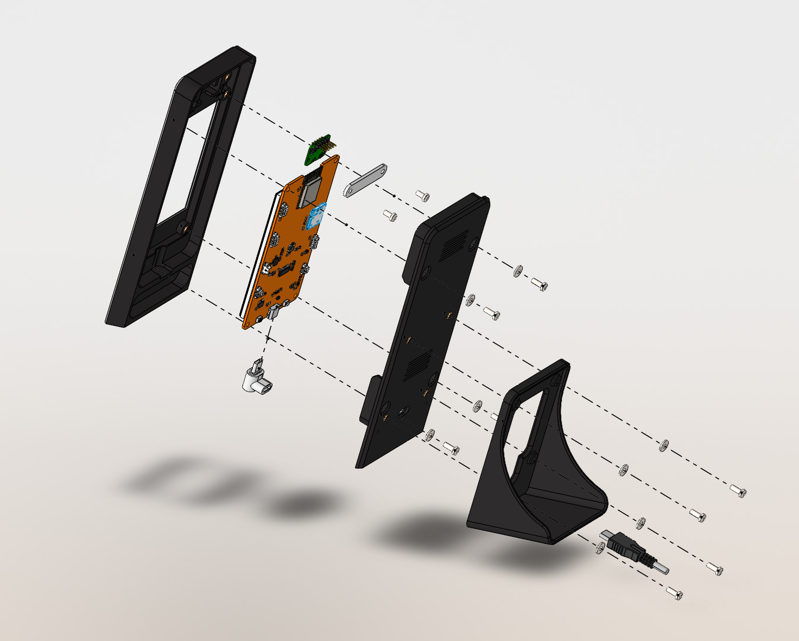
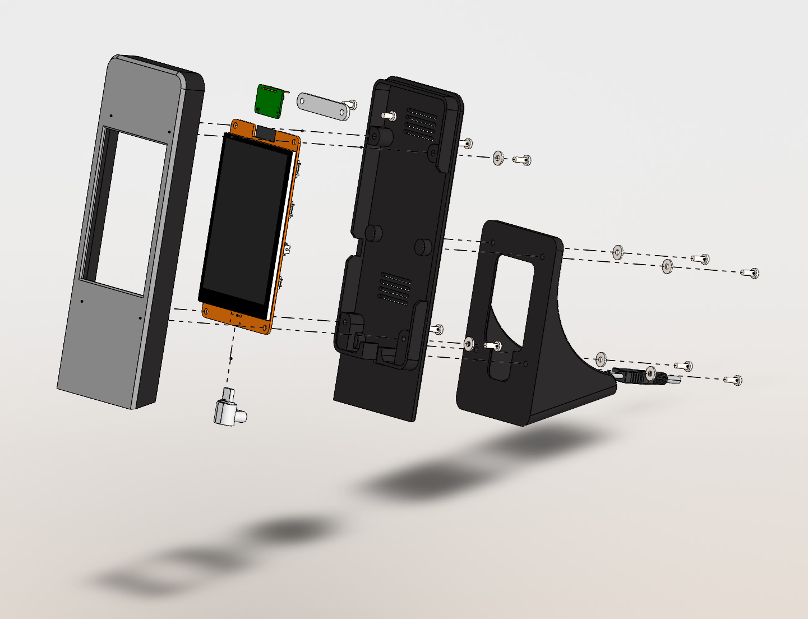
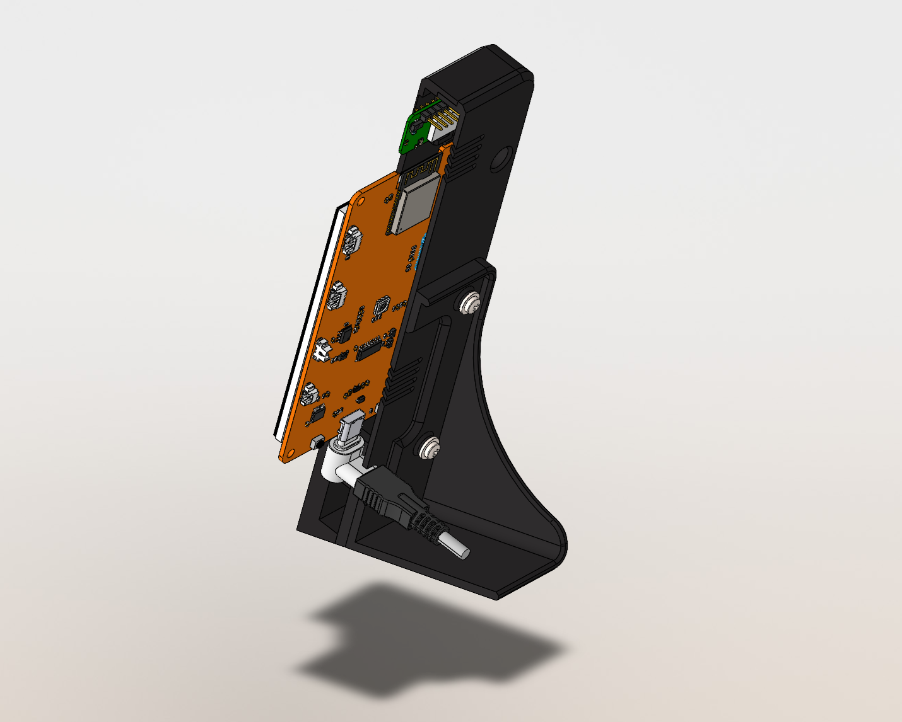
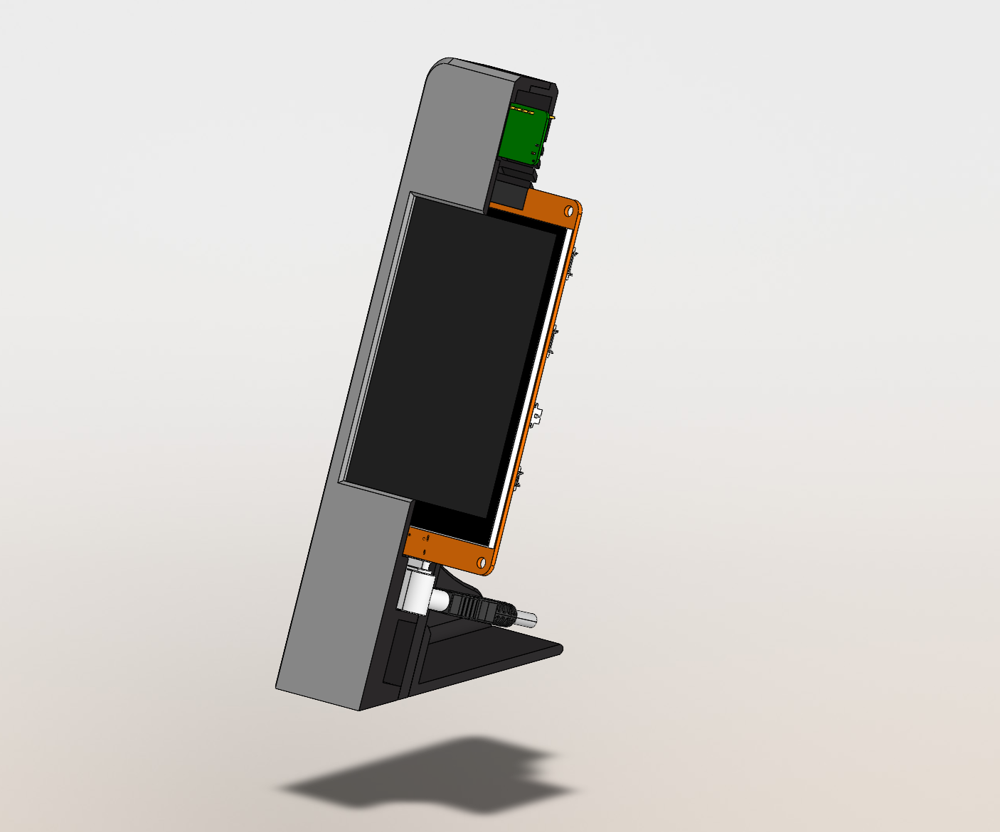
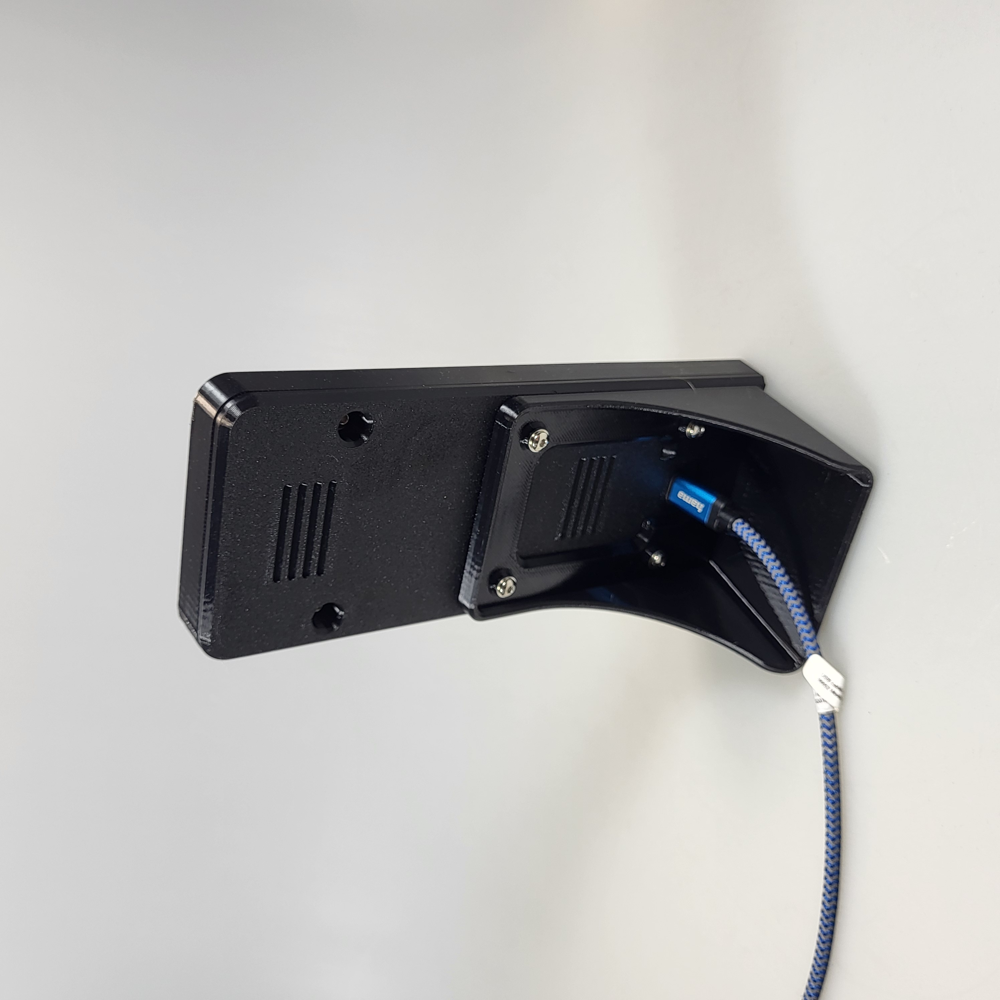

# 3D-printed enclosure and assembly

This enclosure holds the 4-inch ESP32 touchscreen display and an HLK-LD2410C presence radar in portrait orientation. A separate stand supports the assembled display and provides space for the USB power cable.

The screen in this photo shows an older version of the firmware.

## Model files

Print one of each of the four parts below. Use the 3MF project for the prepared print layout, or the individual STEP files to modify the parts in CAD or import them into a compatible slicer.

| File | Description |
| --- | --- |
| [assembly.3mf](assembly.3mf) | Print project containing all four parts, their print layout, saved slicer settings, and color modifiers for the cloud-and-sun emblem on the front lid. |
| [step/Front_Lid.STEP](step/Front_Lid.STEP) | Front enclosure with the display opening, the upper radar area, and insert locations for the enclosure and radar mount. |
| [step/Back_Lid.STEP](step/Back_Lid.STEP) | Rear enclosure with ventilation slots, USB cable clearance, enclosure fastening holes, and insert locations for the stand. |
| [step/Mounting_Radar.STEP](step/Mounting_Radar.STEP) | Retaining mount that secures the radar behind the upper front panel. |
| [step/Stand.STEP](step/Stand.STEP) | Desktop stand that attaches to the back lid with four screws. |

The STEP files contain the individual CAD geometry. The multicolor emblem setup is stored in the 3MF project.

## Parts and tools

Quantities are for one complete enclosure. Amazon links identify the supplied components. Select the listed size when a product offers several variants.

| Quantity | Description | Amazon ASIN | Amazon link |
| --- | --- | --- | --- |
| 10 | M3 threaded heat-set inserts, 4 mm long (M3L4) | B0GF3324TC | [Amazon](https://www.amazon.fr/-/en/dp/B0GF3324TC) |
| 1 | 4-inch CYD ESP32 touchscreen display matching this enclosure | B0FFZ599FJ | [Amazon](https://www.amazon.fr/-/en/dp/B0FFZ599FJ) |
| 1 | USB adapter for the cable routing shown below | B0C9TD16NP | [Amazon](https://www.amazon.fr/-/en/dp/B0C9TD16NP) |
| 1 | HLK-LD2410C presence radar module | B0H4434MG9 | [Amazon](https://www.amazon.fr/-/en/dp/B0H4434MG9) |
| 8 | M3×8 mm hex-socket screws (Allen/inbus) | Not supplied | — |
| 2 | M3×6 mm hex-socket screws (Allen/inbus) | Not supplied | — |
| 8 | M3 washers | Not supplied | — |

The 4-inch display is also available from its manufacturer and official seller, [Freenove](https://store.freenove.com/products/fnk0114?variant=45751420715206). Moreover, for the radar module's original product page, see [Hi-Link HLK-LD2410C](https://www.hlktech.net/index.php?id=1095).

You will also need a compatible 5V USB cable and power supply, a soldering iron with a suitable heat-set insert tip, and tools for cleaning printed edges. Wires with Dupont plugs between the radar and the screen are already included in the screen package delivered by Amazon.

## Printing and preparation

The settings saved in `assembly.3mf` are a reference for the original print:

| Setting | Saved value |
| --- | --- |
| Printer | Bambu Lab P1S |
| Nozzle diameter | 0.4 mm |
| Filament | PETG |
| Layer height | 0.2 mm |
| Walls | 5 |
| Infill | 15% |
| Supports | None in the supplied 3MF project |

Before slicing, select the correct printer and filament profiles for your equipment and review the orientation and color assignments. The project uses black, gray, white, and yellow filament assignments, including white for the cloud and yellow for the sun. Adapt the assignments to your available filament.

Print one front lid, one back lid, one radar mount, and one stand. Clean the mating edges, screw holes, display opening, and cable opening. Check the fit of the printed parts before installing the electronics.

## Assembly

The exploded views show how the display, radar, lids, adapter, and stand fit together. Dashed lines indicate the fastening points.

### 1. Install the threaded inserts

Install all ten M3L4 heat-set inserts before fitting the electronics:

| Printed part | Insert locations | Quantity |
| --- | --- | --- |
| Front lid | Four enclosure fastening points and two radar-mount fastening points | 6 |
| Back lid | Four stand fastening points | 4 |

Support the part on a stable surface. Use the heated insert tip to press each insert straight into its recess, keeping it aligned with the screw axis and seated flush. Set the iron for the insert and printed material. Avoid pushing the insert through the part. Let the inserts and plastic cool before assembly.

### 2. Fit the radar

For this build, I desoldered the preinstalled straight 1×5 Dupont pin header from the radar module and soldered in a 90° pin header instead. This saves space inside the thin enclosure. Make this change before fitting the radar.

Place the radar in the upper area behind the front panel, above the display opening. Match its orientation to the exploded views, with the pin header accessible inside the enclosure. Fit the printed radar retaining mount and secure it to the two upper inserts with the **two M3×6 mm screws**.

### 3. Fit the display and connect the radar

With USB power disconnected, place the display behind the front opening, with the screen facing outward and its USB connector at the bottom. Align the board's four mounting holes with the enclosure fastening points. Support the board without pressing on the screen.

Keep USB power disconnected while wiring the HLK-LD2410C to the display board. Use four wires and identify each connection by its pin label rather than by wire color or connector orientation, especially after replacing the radar's pin header.

| Radar pin | Display board connection | Purpose |
| --- | --- | --- |
| VCC | Regulated 5 V supply shared with the display | Powers the radar. The supply must have more than 200 mA available for the radar in addition to the display's requirements. |
| GND | Display board GND | Provides a common ground for power and signals. |
| TX | GPIO35, labeled GP35 | Sends the radar's serial reports to the ESP32's UART1 receive input. |
| OUT | GPIO32, available as SDA on connector P4 | Sends the active-high presence signal to the ESP32. |
| RX | Leave unconnected | The current firmware does not send commands to the radar. |

Connect VCC and GND first, then TX and OUT according to the table. The radar's TX pin connects to the display's receive input, GPIO35. Keep the radar's RX pin unconnected and prevent it from touching other contacts. The radar is powered from 5 V, but its signal lines use 3.3 V logic. **Do not connect the 5 V supply to GPIO35 or GPIO32!**

The firmware receives serial reports at the radar's factory setting of **256000 baud, 8 data bits, no parity, and 1 stop bit (8N1)**. No sensor configuration is required for a module using these settings. Use the pins in the table: GPIO39 is used by the touchscreen, and UART0 is used by the USB connection for flashing and logs.

Before reconnecting USB power, check the pin labels, power polarity, and all connections for loose contacts or shorts. Insulate exposed wire connections. Route the wires inside the enclosure so that they clear the lid edges, screw holes, and ventilation slots.

### 4. Fit the USB adapter and back lid

Connect the USB adapter to the display's lower USB connector. Position it so the power cable can run toward the rear through the lower opening, as shown below.

Fit the back lid over the display board, checking that the board's mounting holes remain aligned and that no wires are trapped. Secure the back lid to the front lid with **four M3×8 mm screws and four M3 washers**, following the four enclosure fastening lines in the exploded views. Tighten evenly until snug. Avoid overtightening the plastic or loading the display glass.

### 5. Attach the stand

Align the stand's four fastening holes with the four inserts in the back lid. Attach it with the remaining **four M3×8 mm screws and four M3 washers**. Route the USB cable through the space in the stand so it can exit toward the rear without pulling on the display connector.

### 6. Check the finished assembly

- Confirm the display sits squarely in the front opening and the lids meet evenly.
- Check that all screws are snug, the stand is stable, and ventilation slots are clear.
- Check that the USB adapter and cable fit freely without pinching wires or straining the connector.
- Connect USB power and check the display and touch operation. Check radar presence detection after wiring and firmware setup.

See the [user guide](../USER_GUIDE.md) for firmware installation, touchscreen calibration, Wi-Fi setup and radar behaviour. The photos show the physical assembly. Their displayed firmware and interface may differ from the current version.

## Disclaimer

<b>This project and all associated files, documentation, and source code are provided “as is” without any express or implied warranties, including but not limited to the implied warranties of merchantability, fitness for a particular purpose, and non‑infringement. The author and contributors of this repository assume no responsibility or liability for any direct, indirect, incidental, or consequential damages that may occur through the use, modification, or distribution of the software and hardware designs contained herein. This includes, but is not limited to, hardware damage, data loss, malfunctioning devices, or personal injury that may arise from incorrect wiring, improper configuration, or misuse of the provided code and documentation. Users are encouraged to review, test, and verify all code before deploying it on any system. If you choose to use this project, you do so entirely at your own risk. By downloading, copying, modifying, or using any part of this project, you acknowledge that you have read, understood, and agree to this disclaimer.

The HLK-LD2410C radar module’s CE status is unknown to this project. The existence of an EU declaration of conformity or US regulatory compliance documentation has not been verified. Check your local laws and regulatory requirements before using the radar. Use it at your own risk.</b>
